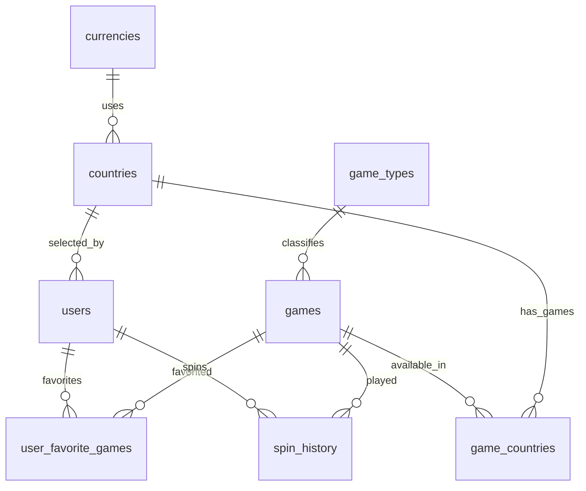

#  Casino — Database Design

## 1. Overview

The database is PostgreSQL and is managed with Prisma migrations.

The schema is normalized around users, games, game types, countries, currencies, availability, favorites, and spin history.

## 2. Entities

Required entities:

- users
- games
- game_types
- countries
- currencies
- game_countries
- user_favorite_games
- spin_history

## 3. Entity Relationship Diagram



## 4. Primary Key Strategy

- `currencies.code` uses natural PK.
- `countries.iso2` uses natural PK.
- Main application entities use UUIDs.
- Join tables use composite primary keys.

UUIDs are generated by Prisma with `@default(uuid())`.

## 5. Decimal Strategy

Money-like values are stored as `DECIMAL(12,2)`.

Backend uses Prisma Decimal.

API responses return decimal values as strings to avoid floating-point ambiguity.

## 6. Tables

### currencies

Stores supported currencies.

Columns:

```text
code PK
name
symbol
decimal_places
created_at
updated_at
```

### countries

Stores supported countries.

Columns:

```text
iso2 PK
iso3 UNIQUE
name
currency_code FK -> currencies.code
created_at
updated_at
```

### game_types

Stores game type taxonomy.

Columns:

```text
id UUID PK
code UNIQUE
name
created_at
updated_at
```

### games

Stores catalog games imported from `game-data.json`.

Columns:

```text
id UUID PK
external_id UNIQUE
slug UNIQUE
title
provider_name
thumbnail_url NULL
start_url NULL
game_type_id FK -> game_types.id
is_active
created_at
updated_at
```

### game_countries

Stores game availability by country.

Columns:

```text
game_id FK -> games.id
country_iso2 FK -> countries.iso2
created_at
```

Primary key:

```text
(game_id, country_iso2)
```

### users

Stores registered users.

Columns:

```text
id UUID PK
email UNIQUE
password_hash
balance DECIMAL(12,2) DEFAULT 0
country_iso2 FK -> countries.iso2
preferred_currency_code FK -> currencies.code
created_at
updated_at
```

Rules:

- email is normalized lowercase;
- balance cannot be negative;
- password hash is never returned by API.

### user_favorite_games

Stores user favorites.

Columns:

```text
user_id FK -> users.id
game_id FK -> games.id
created_at
```

Primary key:

```text
(user_id, game_id)
```

### spin_history

Stores permanent spin history.

Columns:

```text
id UUID PK
user_id FK -> users.id
game_id FK -> games.id
reel1_symbol
reel2_symbol
reel3_symbol
reel_result_key
bet_amount DECIMAL(12,2)
payout_amount DECIMAL(12,2)
net_amount DECIMAL(12,2)
balance_before DECIMAL(12,2)
balance_after DECIMAL(12,2)
created_at
```

Spin history is append-only.

Do not update or delete spin history records.

## 7. Indexes

Recommended indexes:

```sql
CREATE INDEX idx_games_title ON games(title);
CREATE INDEX idx_games_provider_name ON games(provider_name);
CREATE INDEX idx_games_game_type_id ON games(game_type_id);
CREATE INDEX idx_game_countries_country_iso2 ON game_countries(country_iso2);
CREATE INDEX idx_users_country_iso2 ON users(country_iso2);
CREATE INDEX idx_user_favorite_games_game_id ON user_favorite_games(game_id);
CREATE INDEX idx_spin_history_user_created_at ON spin_history(user_id, created_at DESC);
CREATE INDEX idx_spin_history_game_id ON spin_history(game_id);
```

## 8. Constraints

Recommended constraints:

- user balance must be >= 0;
- bet amount must be > 0;
- payout amount must be >= 0;
- `balance_after = balance_before + net_amount`;
- symbols must be valid slot symbols;
- composite join table PKs prevent duplicates.

Prisma migration SQL may be manually edited to add database-level CHECK constraints.

## 9. Seed Strategy

Seeds are idempotent.

Seed domains:

- currencies;
- countries;
- game types;
- games from `game-data.json`;
- game availability.

Seeded currencies:

```text
USD, EUR, GBP, ARS, BRL, CAD, JPY, AUD, CHF, MXN
```

Seeded countries:

```text
MT, GB, US, AR, BR, CA, JP, AU, CH, MX
```

Initial game type:

```text
slot
```

## 10. Out of Scope Tables

The MVP intentionally does not include:

- sessions;
- refresh_tokens;
- slot_paytables;
- slot_reels;
- exchange_rates;
- audit_logs;
- admin tables.

These can be added later if the product evolves.
